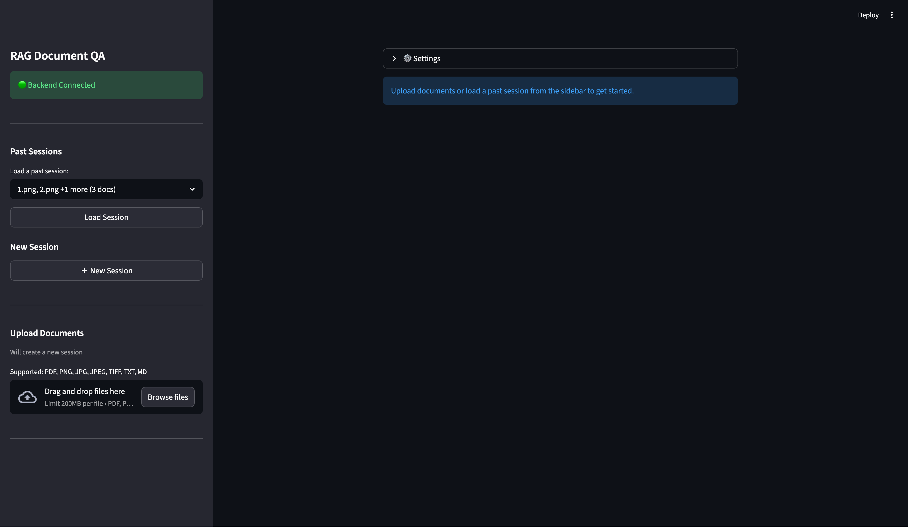
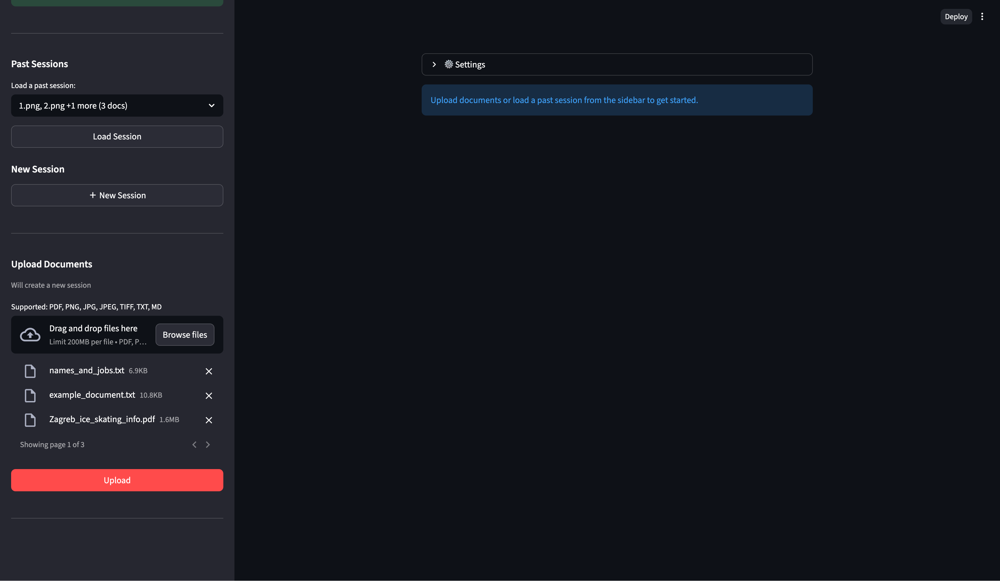
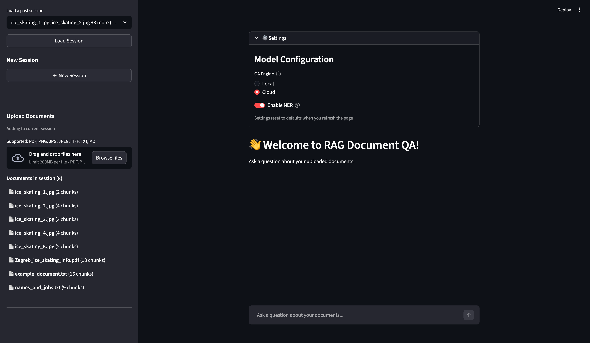
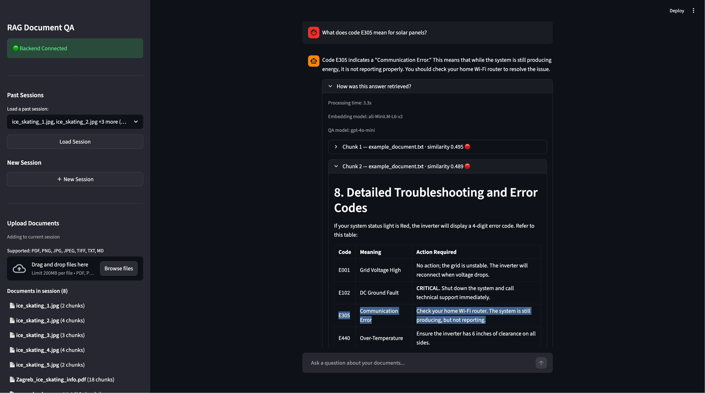
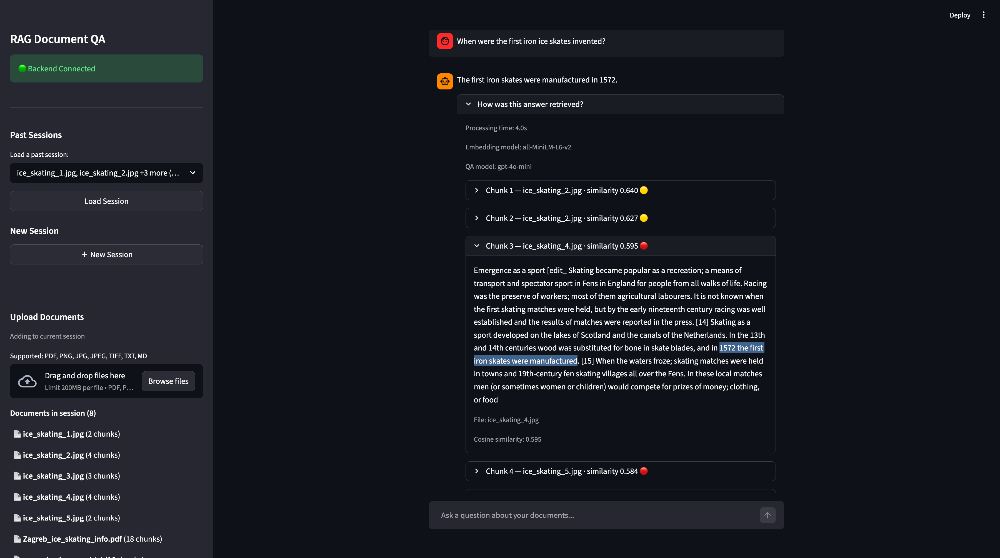
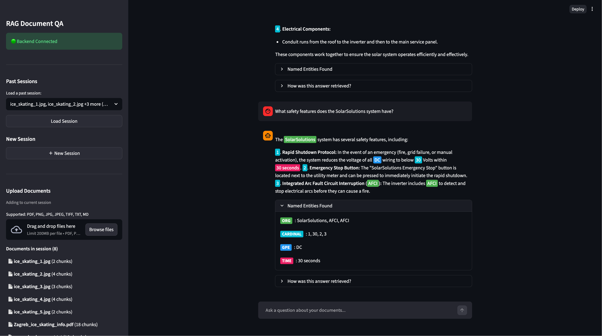
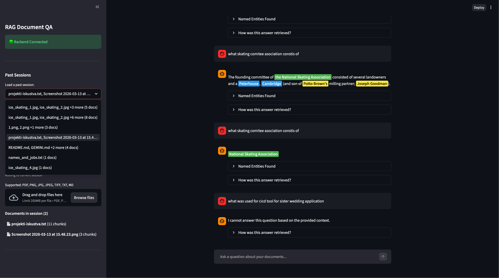

# rag-document-qa
An API-first service designed to turn static documents (PDFs and images) into searchable, interactive data. Users can upload a file and immediately ask questions about its contents—like "What is the total on this invoice?" or "Summarize the termination clause"—receiving AI-generated answers based strictly on the document's text.

## Application Flow

### 1. Initial Application View


When you first open the application, you'll see a clean interface with the sidebar for document management and the main chat area.

### 2. Uploading Documents


Use the upload section in the sidebar to add your documents (PDFs, images, or text files). The application processes them automatically and creates a session.

### 3. Document Management & Settings


Once documents are uploaded, you can see them in the sidebar with their processing status. The settings panel allows you to configure the QA model (cloud vs local) and toggle Named Entity Recognition (NER) highlighting.

### 4. Question Answering with Source Details


Ask questions about your documents and receive answers. Click the expandable sections to see:
- **Model Details**: Which model was used to generate the answer
- **Source Chunks**: The specific document chunks that were retrieved and used for RAG (Retrieval-Augmented Generation)

### 5. Another Q&A Example


Different types of questions are handled, with detailed source information always available to show how the answer was constructed.

### 6. Named Entity Recognition (NER) Highlighting


When NER is enabled, the application automatically identifies and highlights important entities (like money amounts, dates, organizations, people) in the answers, making key information easy to spot.

### 7. Session Management


The application maintains persistent chat sessions. Use the session selector in the sidebar to load previous conversations and continue where you left off. Each session preserves its uploaded documents and chat history.

### Complete Demo Video
Watch the complete application flow in action:

[](docs/videos/app_flow.mp4)


## Setup Instructions

Before running the application, you need to configure environment variables. These settings tell the application how to connect to external services like OpenAI.

1. **Configure Environment Variables**
   ```bash
   # Copy the example environment files to create your local configuration
   # From your project's root directory
   cp backend/.env.example backend/.env
   cp frontend/.env.example frontend/.env
   ```

2. **Set OpenAI API Key** (Required for cloud QA engine)
   ```bash
   # Edit backend/.env and replace:
   OPENAI_API_KEY=<INSERT_YOUR_OPENAI_API_KEY_HERE>
   ```

> **Note**: The `.env.example` files contain all the necessary configuration with sensible defaults. You only need to add your OpenAI API key to enable the cloud-based question answering feature.

## Docker Installation (Recommended)

Start both services with a single command:

```bash
docker compose up --build
```

This builds and starts:
- Backend API on `http://localhost:8000`
- Frontend UI on `http://localhost:8501`

## Manual Installation

Run locally using `uv` (requires Python 3.12+):

```bash
# Backend (in ./backend directory)
uv sync
uv run uvicorn app.main:app --reload --host 0.0.0.0 --port 8000

# Frontend (in ./frontend directory) 
uv sync
uv run streamlit run app.py --server.port 8501
```

> **Note**: There is currently a known issue when running the application manually. I will fix it over the weekend. For now, I recommend using the Docker installation method.

## API Usage

> **Recommendation**: While you can use the API directly, I recommend using the Streamlit frontend at `http://localhost:8501` for the full experience. I developed the frontend to provide session management, chat history, and a more user-friendly interface for uploading documents and asking questions.

### Core Endpoints

#### Upload Documents
```bash
POST /upload
Content-Type: multipart/form-data

# Upload one or more files (PDF, PNG, JPG, TXT, MD)
curl -X POST "http://localhost:8000/upload" \
  -F "files=@document.pdf" \
  -F "files=@image.jpg"
```

**Response:**
```json
{
  "session_id": "a1b2c3d4-e5f6-7890-abcd-ef1234567890",
  "documents": [
    {
      "filename": "document.pdf",
      "chunks": 15,
      "status": "processed"
    }
  ]
}
```

#### Ask Questions
```bash
POST /ask
Content-Type: application/json

{
  "question": "What is the total amount on the invoice?",
  "session_id": "a1b2c3d4-e5f6-7890-abcd-ef1234567890",
  "use_cloud_qa": true
}
```

**Response:**
```json
{
  "answer": "The total amount on the invoice is $1,234.56.",
  "sources": [
    {
      "filename": "document.pdf",
      "chunk_id": 3,
      "text": "Total Amount: $1,234.56"
    }
  ],
  "entities": [
    {"text": "$1,234.56", "label": "MONEY", "start": 23, "end": 32}
  ]
}
```

### Additional Endpoints

The API also provides session management and chat history features:
- `GET /sessions/` - List all sessions
- `GET /sessions/{session_id}` - Get session details  
- `POST /chat/message` - Save chat messages
- `GET /chat/history/{session_id}` - Get chat history

## Architecture & Tools

### Core Technologies

- **FastAPI** - Async web framework with auto-generated OpenAPI docs and native Pydantic integration
- **ChromaDB** - Vector database with built-in persistence and metadata filtering for document embeddings
- **OpenAI API** - High-quality question answering with easy integration and reliable performance
- **EasyOCR** - Multi-language OCR engine providing accurate text extraction from images and scanned documents
- **PyMuPDF** - Fast PDF text extraction with reliable performance and small footprint
- **sentence-transformers** - Free local embeddings using the `all-MiniLM-L6-v2` model for semantic search

### Key Features

- **RAG Pipeline**: Document chunking → embedding → retrieval → answer generation
- **Multi-format Support**: PDF, images (PNG/JPG), and text files
- **Session Management**: Persistent document storage across requests
- **Named Entity Recognition**: Highlights entities like money, dates, and organizations in responses
- **Flexible QA**: Choose between cloud (OpenAI) or local (DistilBERT) question answering

## Development

The project uses `uv` for fast dependency management and includes comprehensive testing with `pytest`. See `docs/IMPLEMENTATION_PLAN.md` for detailed technical decisions and architecture.
